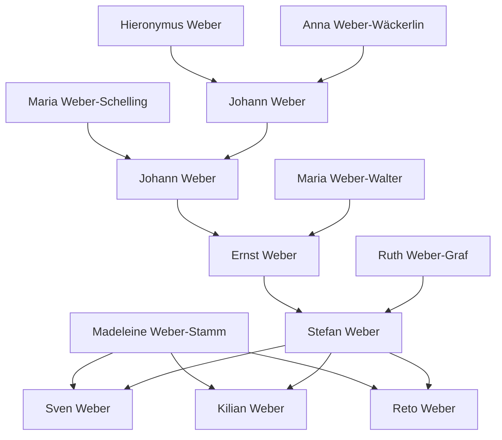

```mermaid
flowchart TD
  1834M[Hieronymus Weber] --> 1874M
  1834W[Anna Weber-Wäckerlin] --> 1874M
  1879W[Maria Weber-Schelling] --> 1903M
  1874M[Johann Weber] --> 1903M
  1903M[Johann Weber] --> 1938M
  1901[Maria Weber-Walter] --> 1938M
  1938M[Ernst Weber] --> 1963M
  1937W[Ruth Weber-Graf] --> 1963M
  1964W[Madeleine Weber-Stamm] --> 1988M[Sven Weber]
  1963M[Stefan Weber] --> 1988M
  1964W --> 1990M[Kilian Weber]
  1963M --> 1990M
  1964W --> 1992M[Reto Weber]
  1963M --> 1992M
```

- Siblingen Ehe-Register A 1924-1941, Seite 28:
- Aus Familienregister der Gemeinde Siblingen 1876-1909 Band I, Seite 267: